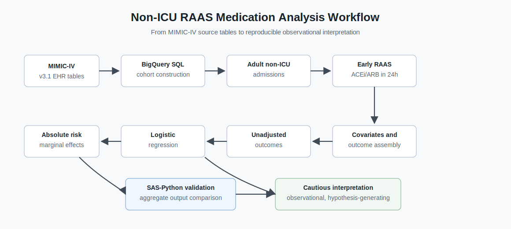
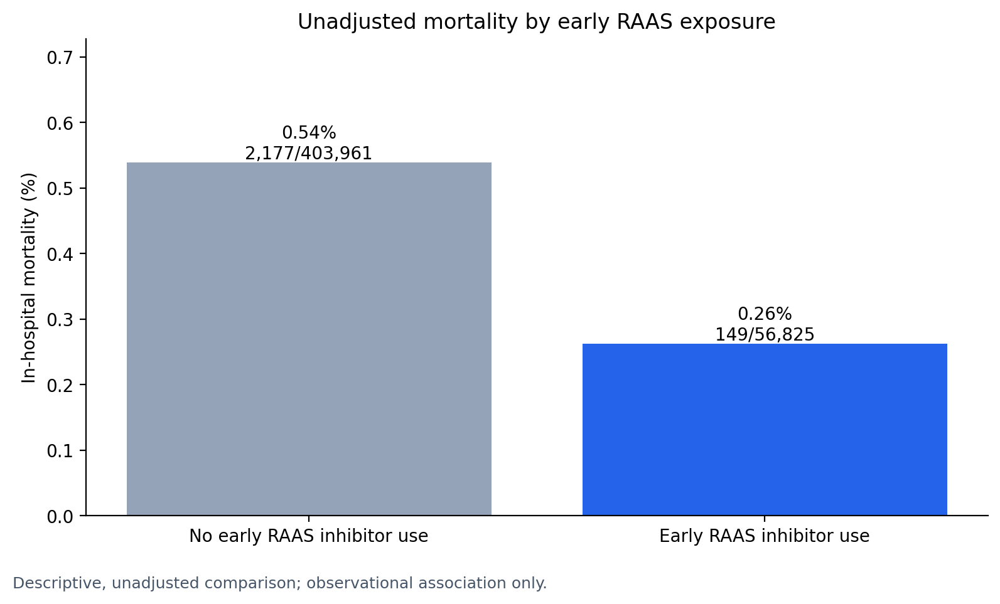
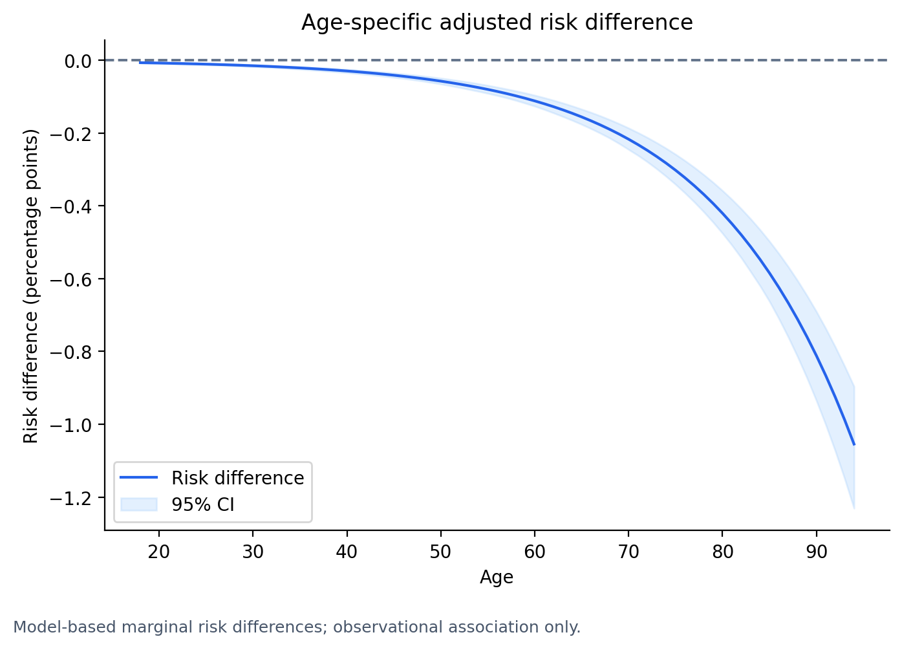

# Early RAAS Inhibitor Exposure and In-Hospital Mortality in Non-ICU Admissions

*A reproducible MIMIC-IV clinical analytics portfolio project*

Makoto Yoshida, PhD<br>
Clinical Data Analytics Portfolio<br>
LinkedIn: https://www.linkedin.com/in/makoto-yoshida/

## Overview

This repository presents an EHR-based retrospective cohort study using MIMIC-IV v3.1. It evaluates whether early inpatient exposure to renin-angiotensin-aldosterone system (RAAS) inhibitors is associated with in-hospital mortality among adult non-ICU hospital admissions.

The primary clinical analysis is multivariable logistic regression with absolute risk estimation using average marginal effects. Findings are interpreted as hypothesis-generating associations, not causal effects.

[View the Quarto HTML report](outputs/reports/nonicu_raas_mortality_report.html)

The Quarto report is the polished portfolio-style clinical analytics report. This README is the project overview.

## What This Demonstrates

- Real-world evidence workflow using hospital EHR data
- Reproducible cohort, exposure, covariate, and outcome construction in BigQuery SQL
- Transparent early medication exposure definition using ACE inhibitor and ARB orders within 24 hours of admission
- Multivariable logistic regression with odds ratios, adjusted risks, and average marginal effects
- Cross-platform validation of selected unadjusted and logistic model outputs
- Clear separation between clinical analysis, validation artifacts, and compliance-safe repository contents

## Workflow



## Why This Project Matters

This project shows how clinical analytics teams can move from raw EHR tables to an auditable real-world evidence workflow. It emphasizes transparent cohort, exposure, covariate, and outcome definitions; multivariable regression; and absolute risk interpretation for findings that need to be understandable beyond a purely statistical audience.

For clinical analytics, RWE, HEOR, and outcomes research teams, the portfolio value is the operational workflow: defensible data definitions, documented modeling choices, reproducible notebooks, and SAS/Python output checks. Limitations, including residual confounding and non-causal interpretation, are documented in the [discussion](docs/DISCUSSION_AND_LIMITATIONS.md).

## Key Findings

- The analytic cohort included 460,786 adult non-ICU hospital admissions.
- Early RAAS inhibitor exposure occurred in 56,825 admissions, or 12.33% of the cohort.
- Crude in-hospital mortality was lower among early RAAS-exposed admissions than among unexposed admissions.
- After multivariable adjustment, early RAAS exposure was associated with lower odds of in-hospital mortality: OR 0.32 (95% CI 0.27-0.38).
- On the absolute risk scale, early RAAS exposure was associated with an average reduction of approximately 0.38 percentage points in predicted in-hospital mortality.
- Age-specific adjusted analyses suggested larger absolute risk differences among older patients.

See [Results summary](docs/RESULTS_SUMMARY.md) and [Discussion and limitations](docs/DISCUSSION_AND_LIMITATIONS.md) for interpretation details.

## Results Visualizations

The README uses two primary figures to keep the result flow concise: observed outcome contrast first, then adjusted absolute risk interpretation. Technical validation remains in the reproducibility documentation rather than the main visual narrative.

### Crude Outcome Comparison

Observed in-hospital mortality was lower among admissions with early RAAS inhibitor exposure than among unexposed admissions.



### Adjusted Absolute Risk Interpretation

After multivariable adjustment, the absolute risk difference remained small in percentage-point terms and varied by age group.



## Technical Snapshot

| Area | Details |
| --- | --- |
| Data | MIMIC-IV v3.1 hospital admissions |
| Design | Retrospective observational cohort study |
| Population | Adult inpatient admissions excluding ICU stays |
| Exposure | ACE inhibitor or ARB prescription started within 24 hours after hospital admission |
| Primary outcome | In-hospital mortality |
| Primary model | Multivariable logistic regression |
| Absolute risk estimand | Adjusted predicted risks and average marginal effects |
| Validation | SAS-Python comparison of exported unadjusted and logistic model outputs |
| Tools | BigQuery SQL, Python, Jupyter, SAS |

Exposure is based on inpatient prescription records and does not directly capture outpatient chronic use, adherence, dose, or duration.

## Explore The Project

- [01 cohort construction](notebooks/01_cohort.ipynb) and [short notes](docs/01_cohort_SHORT.md)
- [02 exposure definition](notebooks/02_exposure.ipynb) and [short notes](docs/02_exposure_SHORT.md)
- [03a input table validation](notebooks/03a_validate_input_tables.ipynb) and [short notes](docs/03a_validate_input_tables_SHORT.md)
- [03b analysis dataset description](notebooks/03b_describe_analysis_dataset.ipynb) and [short notes](docs/03b_describe_analysis_dataset_SHORT.md)
- [04a unadjusted outcomes](notebooks/04a_unadjusted_outcomes.ipynb) and [short notes](docs/04a_unadjusted_outcomes_SHORT.md)
- [04b multivariable outcomes](notebooks/04b_multivariable_outcomes.ipynb) and [short notes](docs/04b_multivariable_outcomes_SHORT.md)
- [05 SAS-Python reproducibility validation](notebooks/05_sas_python_validation.ipynb) and [short notes](docs/05_sas_python_validation_SHORT.md)
- [SAS programs](sas/programs/) and [SAS workflow notes](sas/README.md)
- [BigQuery SQL](sql/) and [infrastructure sanity check](scripts/validation_checklist.py)

## Detailed Documentation

- [Study background](docs/STUDY_BACKGROUND.md): RAAS biology, hospital medicine rationale, and prior literature
- [Methods overview](docs/METHODS_OVERVIEW.md): design, cohort, exposure, outcome, covariates, and modeling plan
- [Results summary](docs/RESULTS_SUMMARY.md): concise findings without causal strengthening
- [Discussion and limitations](docs/DISCUSSION_AND_LIMITATIONS.md): interpretation, residual confounding, and generalizability
- [Setup and reproducibility](docs/SETUP.md): Python environment, notebook execution expectations, and hygiene guidance
- [Validation notes](docs/VALIDATION_NOTES.md): Python/SAS validation scope and discrepancy notes
- [Figure reproducibility](docs/FIGURE_REPRODUCIBILITY.md): README figure export locations and refresh workflow

## Reproducibility And Validation

The workflow uses version-controlled notebooks, SQL scripts, SAS programs, and aggregate validation CSVs. No patient-level data are included in this repository. See [Setup and reproducibility](docs/SETUP.md) for the lightweight Python environment and notebook hygiene workflow.

Validation scope:

- `04b_multivariable_outcomes.ipynb` contains the primary clinical analysis: multivariable logistic regression and absolute risk estimation.
- `05_sas_python_validation.ipynb` compares exported Python and SAS outputs; it is reproducibility validation, not a new clinical analysis.
- SAS programs under `sas/programs/` generate comparison outputs under `sas/outputs/`.
- Python validation artifacts are stored under `python/outputs/`.
- `scripts/validation_checklist.py` performs lightweight BigQuery table-existence checks only; it does not validate table contents or statistical results.

MIMIC-IV/PhysioNet access, Google Cloud authentication, BigQuery access, and local SAS paths are configured outside the repository.

## Project Structure

```text
mimic-iv-nonicu-medication/
|-- assets/           # Portfolio visuals
|-- docs/             # Study background, methods, results, limitations, validation notes
|-- notebooks/        # Stepwise analysis and validation notebooks
|-- python/outputs/   # Aggregate Python validation CSVs
|-- sas/              # SAS workflow notes, programs, and aggregate validation outputs
|-- scripts/          # Validation utilities
|-- sql/              # BigQuery SQL for cohort/exposure construction
|-- requirements.txt  # Lightweight Python notebook environment
`-- README.md
```

## Data Source And Compliance

This project uses MIMIC-IV v3.1, maintained by the MIT Laboratory for Computational Physiology and made available via PhysioNet.

Johnson A., Bulgarelli L., Pollard T., Gow B., Moody B., Horng S., Celi L.A., & Mark R. (2024). *MIMIC-IV (version 3.1)*. PhysioNet. RRID:SCR_007345. https://doi.org/10.13026/kpb9-mt58.

Access was granted after required training and approval under the PhysioNet data use agreement. This repository contains no patient-level data.
