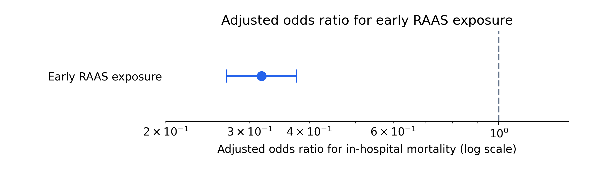
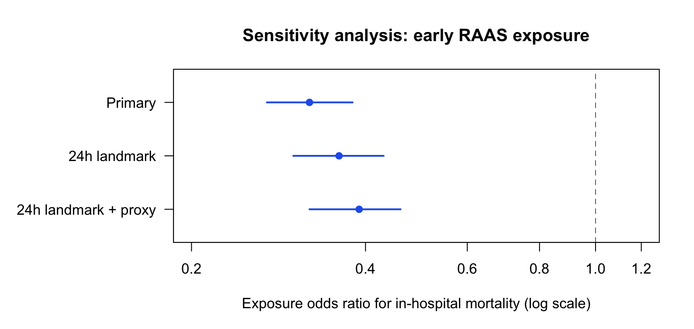
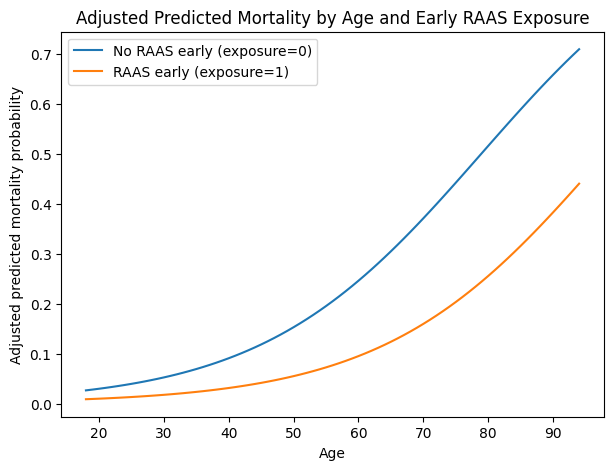

## Analytical Report Scope

This report presents the analytic outputs from an admission-level observational study of early inpatient renin-angiotensin-aldosterone system (RAAS) inhibitor exposure and in-hospital mortality among adult non-ICU admissions in MIMIC-IV v3.1.

The emphasis is on reproducible clinical analytics: cohort construction, exposure definition, covariate handling, outcome modeling, absolute risk interpretation, and cross-platform validation using aggregate Python and SAS outputs already produced by the project.

The results remain hypothesis-generating. The design estimates associations after adjustment for measured covariates; it does not establish treatment effectiveness.

## Reproducible Workflow

The workflow separates data construction, model estimation, visualization, and validation. The analytic sequence starts with an adult hospital admission cohort, excludes ICU-associated admissions, classifies early ACE inhibitor or ARB exposure from inpatient prescription records, fits adjusted outcome models, and validates selected aggregate outputs across Python and SAS.

The key design choice is that the fixed non-ICU cohort is constructed before exposure definition or outcome modeling. This keeps cohort eligibility independent of treatment status and makes the downstream descriptive, adjusted, absolute-risk, and validation outputs traceable to one admission-level analysis table.

{fig-alt="Analysis workflow diagram" width="80%"}

## Cohort And Exposure

The analytic cohort contained 460,786 adult non-ICU hospital admissions. Early RAAS inhibitor exposure was observed in 56,825 admissions, or 12.33% of the cohort.

Source notebooks: [01_cohort.ipynb](https://github.com/makotoy56/mimic-iv-nonicu-medication/blob/main/notebooks/01_cohort.ipynb) and [02_exposure.ipynb](https://github.com/makotoy56/mimic-iv-nonicu-medication/blob/main/notebooks/02_exposure.ipynb).

| Cohort measure | Value |
| --- | ---: |
| Adult non-ICU hospital admissions | 460,786 |
| No early RAAS inhibitor exposure | 403,961 |
| Early RAAS inhibitor exposure | 56,825 |
| Early RAAS exposure prevalence | 12.33% |
| In-hospital deaths | 2,326 |
| Overall in-hospital mortality | 0.50% |

## Baseline Characteristics

The baseline table summarizes the existing Table 1-style outputs. The main imbalance relevant to interpretation is age: exposed admissions were substantially older than unexposed admissions, reinforcing the need for adjusted outcome modeling.

Source notebook and supporting documentation: [03b_describe_analysis_dataset.ipynb](https://github.com/makotoy56/mimic-iv-nonicu-medication/blob/main/notebooks/03b_describe_analysis_dataset.ipynb) and [03b_describe_analysis_dataset_SHORT.md](https://github.com/makotoy56/mimic-iv-nonicu-medication/blob/main/docs/03b_describe_analysis_dataset_SHORT.md).

| Characteristic | No early RAAS | Early RAAS | Analytic implication |
| --- | ---: | ---: | --- |
| Admissions, n | 403,961 | 56,825 | Exposure was present in 12.33% of admissions |
| Age, mean (SD), years | 56.65 (19.55) | 68.63 (14.01) | Exposed admissions were older |
| Age, median (IQR), years | 58.00 (41.00, 72.00) | 69.00 (59.00, 79.00) | Age imbalance supports adjustment |
| Hospital LOS, mean (SD), days | 3.75 (5.45) | 3.98 (5.13) | Length of stay was similar but slightly higher in exposed admissions |
| Hospital LOS, median (IQR), days | 2.33 (0.92, 4.58) | 2.75 (1.50, 4.79) | Descriptive only; not an exposure eligibility criterion |
| Female sex, n (%) | 218,834 (54.17%) | 27,549 (48.48%) | Sex distribution differed modestly by exposure group |
| Male sex, n (%) | 185,127 (45.83%) | 29,276 (51.52%) | RAAS-exposed admissions were more frequently male |
| Any early RAAS exposure | 0.00 | 1.00 | Primary exposure flag |
| Early ACE inhibitor exposure | 0.00 | 0.682 | Exposure subtype among exposed admissions |
| Early ARB exposure | 0.00 | 0.326 | Exposure subtype among exposed admissions |
| Concurrent early ACE inhibitor and ARB exposure | 0.00 | 0.008 | Rare combined early exposure |

## Endpoint And Model Specification

The primary endpoint was in-hospital mortality, defined by `hospital_expire_flag`. The primary model was a multivariable logistic regression adjusted for age, gender, race group, admission type, insurance category, and admission calendar period.

| Component | Specification |
| --- | --- |
| Unit of analysis | Hospital admission |
| Primary exposure | Any ACE inhibitor or ARB prescription started within 24 hours after admission |
| Primary endpoint | In-hospital mortality |
| Model family | Logistic regression |
| Adjustment set | Age, gender, race group, admission type, insurance category, anchor year group |
| Main estimands | Adjusted odds ratio, adjusted predicted risks, average marginal effect |
| Sensitivity models | 24-hour landmark model; 24-hour landmark plus admission-source proxy |

## Unadjusted Mortality

The unadjusted outcome table summarizes crude mortality estimates before covariate adjustment. These estimates are descriptive only and do not address baseline differences between exposure groups.

Source notebook and supporting documentation: [04a_unadjusted_outcomes.ipynb](https://github.com/makotoy56/mimic-iv-nonicu-medication/blob/main/notebooks/04a_unadjusted_outcomes.ipynb) and [04a_unadjusted_outcomes_SHORT.md](https://github.com/makotoy56/mimic-iv-nonicu-medication/blob/main/docs/04a_unadjusted_outcomes_SHORT.md).

| Exposure group | Admissions, n | Deaths, n | Non-deaths, n | Mortality proportion | Crude odds | Crude OR vs no early RAAS |
| --- | ---: | ---: | ---: | ---: | ---: | ---: |
| No early RAAS inhibitor use | 403,961 | 2,177 | 401,784 | 0.005389 | 0.005418 | 1.000 |
| Early RAAS inhibitor use | 56,825 | 149 | 56,676 | 0.002622 | 0.002629 | 0.485 |

{fig-alt="Bar chart comparing unadjusted in-hospital mortality by early RAAS exposure" width="80%"}

## Multivariable Logistic Regression

The primary adjusted model estimated lower odds of in-hospital mortality among admissions with early RAAS inhibitor exposure after adjustment for measured demographic and admission-related covariates.

Source notebook and supporting documentation: [04b_multivariable_outcomes.ipynb](https://github.com/makotoy56/mimic-iv-nonicu-medication/blob/main/notebooks/04b_multivariable_outcomes.ipynb) and [04b_multivariable_outcomes_SHORT.md](https://github.com/makotoy56/mimic-iv-nonicu-medication/blob/main/docs/04b_multivariable_outcomes_SHORT.md).

The selected coefficient table summarizes key parameters from the primary adjusted logistic regression model. The table emphasizes the exposure term and representative adjusted covariates; it is not a causal effect table.

| Term | Coefficient | 95% CI for coefficient | Adjusted OR | 95% CI for OR | p-value |
| --- | ---: | ---: | ---: | ---: | ---: |
| Early RAAS exposure | -1.146 | -1.314, -0.978 | 0.318 | 0.269, 0.376 | 6.42e-41 |
| Age | 0.065 | 0.062, 0.069 | 1.067 | 1.064, 1.071 | 0 |
| Male gender | 0.190 | 0.107, 0.274 | 1.210 | 1.112, 1.315 | 8.59e-06 |
| Black race group | -0.534 | -0.756, -0.313 | 0.586 | 0.470, 0.731 | 2.27e-06 |
| Hispanic race group | -0.721 | -1.022, -0.419 | 0.486 | 0.360, 0.658 | 2.84e-06 |
| Medicare insurance | -0.094 | -0.269, 0.080 | 0.910 | 0.764, 1.084 | 0.289 |
| Other insurance | 2.683 | 2.492, 2.874 | 14.628 | 12.089, 17.702 | 2.14e-167 |
| Anchor year 2020-2022 | 0.416 | 0.269, 0.564 | 1.517 | 1.308, 1.758 | 3.22e-08 |

{fig-alt="Forest plot of adjusted odds ratios from the multivariable model" width="90%"}

Admission-type coefficients in the exported model output have very wide intervals for some categories. These terms are retained as adjustment variables but are not interpreted as stable clinical findings.

## Sensitivity Analyses

Sensitivity analyses evaluated whether the exposure association was directionally stable when restricting to admissions surviving beyond 24 hours and when adding an admission-source proxy.

Source notebook: [04b_multivariable_outcomes.ipynb](https://github.com/makotoy56/mimic-iv-nonicu-medication/blob/main/notebooks/04b_multivariable_outcomes.ipynb).

{fig-alt="Landmark sensitivity analysis odds ratio summary" width="80%"}

| Model | Exposure OR | 95% CI | Purpose |
| --- | ---: | ---: | --- |
| Primary adjusted model | 0.32 | 0.27, 0.38 | Main association estimate |
| 24-hour landmark model | 0.36 | 0.30, 0.43 | Reduces immortal-time bias from deaths before exposure opportunity |
| 24-hour landmark plus proxy model | 0.39 | 0.32, 0.46 | Adds admission-source proxy for baseline severity context |

The sensitivity estimates were directionally similar to the primary model, but they do not eliminate residual confounding or convert the analysis into a causal design.

## Absolute Risk Interpretation

The adjusted odds ratio is a relative measure. Because in-hospital mortality was uncommon in this non-ICU cohort, the project also reported absolute risk estimates and average marginal effects. The estimated average adjusted risk difference associated with early RAAS exposure was approximately -0.38 percentage points.

Source notebook: [04b_multivariable_outcomes.ipynb](https://github.com/makotoy56/mimic-iv-nonicu-medication/blob/main/notebooks/04b_multivariable_outcomes.ipynb).

{fig-alt="Adjusted predicted mortality curves by age and early RAAS exposure" width="90%"}

Because this is an observational model-based estimate, the curves should be interpreted as adjusted predicted probabilities under the fitted model, not as causal treatment effects. The figure is useful for communicating how the modeled association varies across age.

| Adjusted risk estimand | Estimate |
| --- | ---: |
| Average predicted mortality risk without early RAAS exposure | 0.5733% |
| Average predicted mortality risk with early RAAS exposure | 0.1936% |
| Average marginal effect / risk difference | -0.38 percentage points |

{fig-alt="Plot of age-specific adjusted absolute risk differences for early RAAS exposure" width="90%"}

The age-specific figure shows why absolute risk reporting matters: the same relative association can correspond to different absolute differences across the age distribution.

## SAS-Python Validation

The validation workflow compares aggregate Python and SAS outputs. It is a reproducibility check, not a second clinical analysis and not a new estimand.

Source notebook and supporting documentation: [05_sas_python_validation.ipynb](https://github.com/makotoy56/mimic-iv-nonicu-medication/blob/main/notebooks/05_sas_python_validation.ipynb), [05_sas_python_validation_SHORT.md](https://github.com/makotoy56/mimic-iv-nonicu-medication/blob/main/docs/05_sas_python_validation_SHORT.md), and [VALIDATION_NOTES.md](https://github.com/makotoy56/mimic-iv-nonicu-medication/blob/main/docs/VALIDATION_NOTES.md).

The table below summarizes selected aggregate outputs used for cross-platform validation between Python and SAS.

| Validation item | Python output | SAS output | Agreement |
| --- | ---: | ---: | --- |
| No early RAAS admissions | 403,961 | 403,961 | Matched |
| No early RAAS deaths | 2,177 | 2,177 | Matched |
| Early RAAS admissions | 56,825 | 56,825 | Matched |
| Early RAAS deaths | 149 | 149 | Matched |
| Exposure coefficient | -1.146180594 | -1.146180594 | Matched to displayed precision |
| Exposure adjusted OR | 0.3178484462 | 0.3178484462 | Matched to displayed precision |
| Exposure OR lower CI | 0.2687743071 | 0.2687743084 | Numerically equivalent after rounding |
| Exposure OR upper CI | 0.3758827838 | 0.3758827820 | Numerically equivalent after rounding |

Observed differences for some sparse admission-type terms are validation diagnostics for model implementation and sparse-category behavior. They should not be interpreted as new clinical findings.

## Interpretation Boundary

The primary adjusted association was consistent across the main model and the reported sensitivity analyses, and the exposure term was stable across Python and SAS validation outputs. The analysis remains observational.

The main sources of potential bias are residual confounding by indication, unmeasured comorbidity burden, acute physiologic severity, outpatient medication history, prescribing behavior, medication discontinuation, dose, duration, adherence, and selection effects related to early survival and treatment eligibility.

Exposure was based on inpatient prescription records. It did not directly measure outpatient chronic RAAS inhibitor use, medication adherence before admission, inpatient administration confirmation, or duration of therapy. The outcome was limited to in-hospital mortality.

## Reproducibility And Governance

Reproducibility was addressed by separating cohort construction, exposure definition, model estimation, figure generation, and SAS-Python validation into version-controlled workflow steps. The rendered report is supported by notebooks, SQL definitions, aggregate validation outputs, and exported figures, while patient-level MIMIC-IV data remain outside the repository.

For complete environment and reproducibility details, see [REPRODUCIBILITY.md](https://github.com/makotoy56/mimic-iv-nonicu-medication/blob/main/REPRODUCIBILITY.md).

MIMIC-IV and PhysioNet access, Google Cloud authentication, BigQuery access, and local SAS paths are configured outside the repository.

## Conclusion

Early inpatient RAAS inhibitor exposure was associated with lower in-hospital mortality in this adult non-ICU MIMIC-IV cohort after adjustment for measured covariates. The association was also presented on the absolute risk scale, where the average adjusted risk difference was small in percentage-point terms and varied by age.

The portfolio value of the project is the reproducible clinical analytics workflow: transparent cohort and exposure definitions, multivariable modeling, absolute risk interpretation, cautious observational framing, and selected SAS-Python validation using aggregate outputs.
