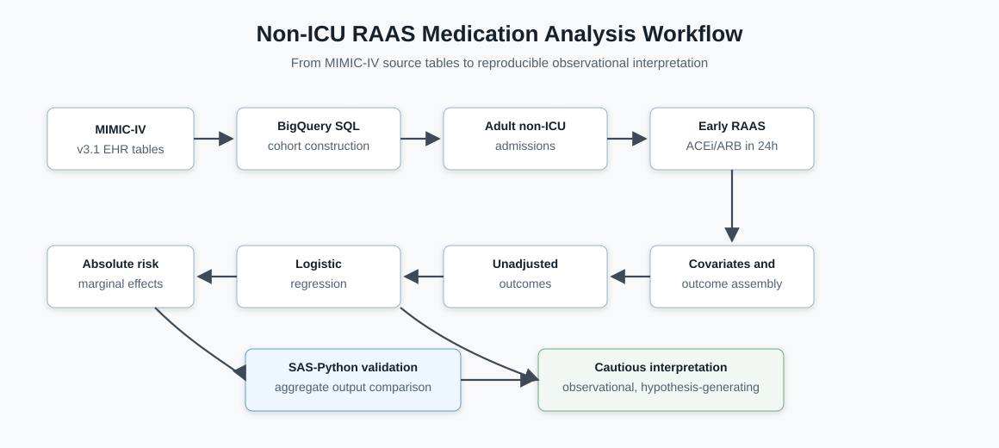
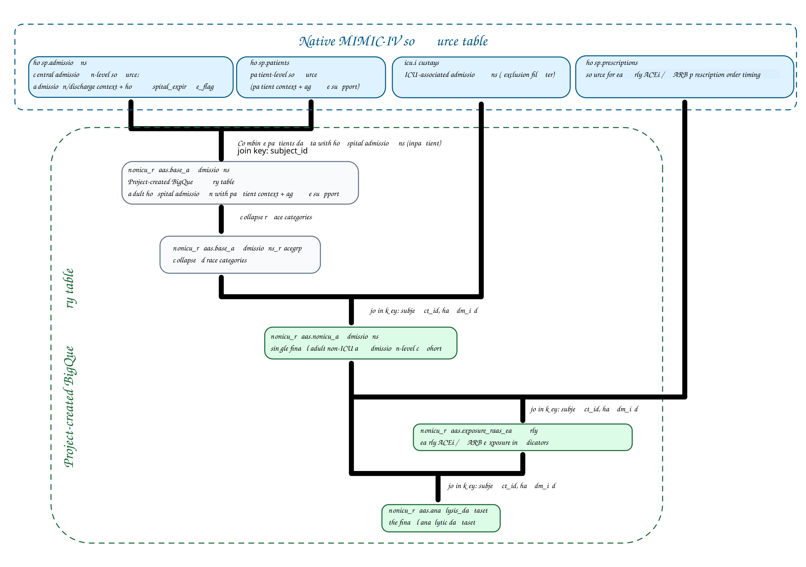
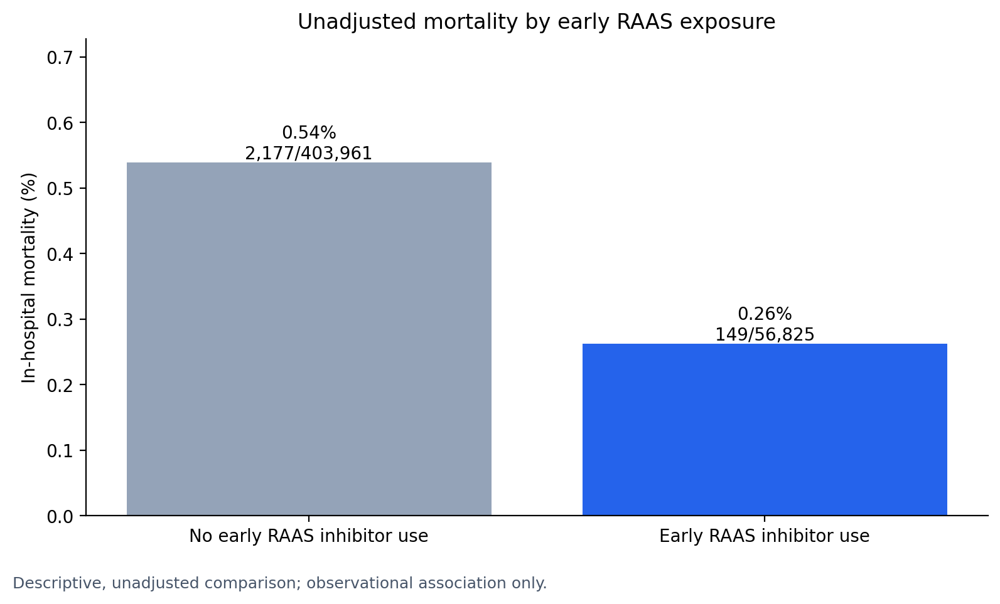
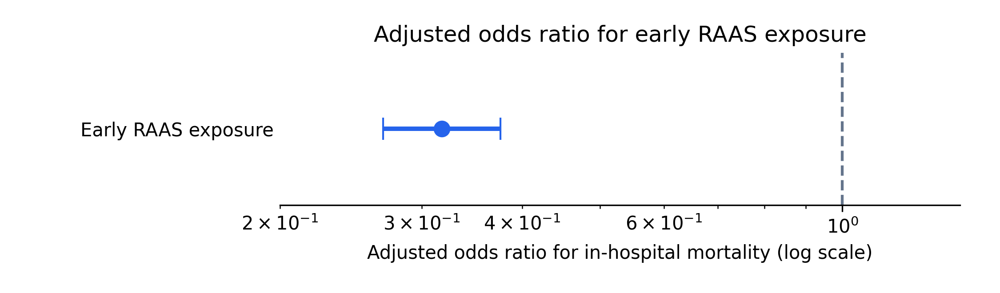
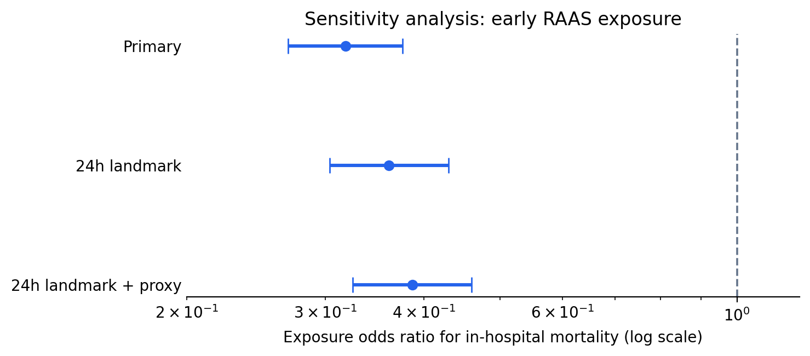
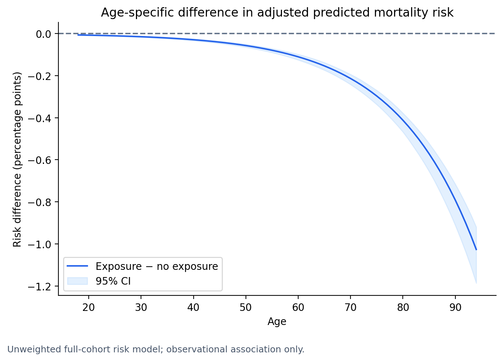

## Analytical Report Scope

This report presents the analytic outputs from an admission-level observational study of documented inpatient renin-angiotensin-aldosterone system (RAAS) prescription exposure within the first 24 hours and in-hospital mortality among adult non-ICU admissions in MIMIC-IV v3.1.

The emphasis is on reproducible clinical analytics: cohort construction, exposure definition, covariate handling, outcome modeling, absolute risk interpretation, and cross-platform validation using aggregate Python and SAS outputs already produced by the project.

The results remain hypothesis-generating. The design estimates associations after adjustment for measured covariates; it does not establish treatment effectiveness.

The primary adjusted exposure OR was 0.318 (95% CI 0.269-0.376), and the fitted absolute-risk model produced an average adjusted predicted mortality difference of -0.3797 percentage points. The 24-hour landmark OR was 0.36 and the landmark-plus-proxy OR was 0.39. These directionally consistent estimates remain observational and may reflect treatment eligibility, confounding by indication, early clinical stability, clinician prescribing behavior, and unmeasured clinical severity.

## Reproducible Workflow

The workflow separates data construction, model estimation, visualization, and validation. The analytic sequence starts with an adult hospital admission cohort, excludes ICU-associated admissions, classifies documented ACE inhibitor or ARB prescription exposure from records with start times within 24 hours, fits adjusted outcome models, and validates selected aggregate outputs across Python and SAS.

The key design choice is that the fixed non-ICU cohort is constructed before exposure definition or outcome modeling. This keeps cohort eligibility independent of prescription-exposure status and makes the downstream descriptive, adjusted, absolute-risk, and validation outputs traceable to one admission-level analysis table.

<figure class="figure">
  
  <figcaption>End-to-end cohort construction and analysis workflow. <a href="../assets/workflow_diagram.svg" target="_blank" rel="noopener">Open full-size workflow diagram</a>.</figcaption>
</figure>

### Source Tables To Analysis Dataset

The lineage figure separates native MIMIC-IV source tables from SQL-derived, project-created BigQuery tables. It shows how source tables feed `nonicu_raas.nonicu_admissions`, the fixed adult non-ICU admission-level cohort; `nonicu_raas.exposure_raas_early`, which contains documented early inpatient ACEi / ARB prescription-exposure indicators; and `nonicu_raas.analysis_dataset`, the final analysis-ready dataset for the observational association analyses.

<figure class="figure">
  
  <figcaption>Source tables to analysis dataset lineage. <a href="../assets/nonicu_table_lineage_construction.svg" target="_blank" rel="noopener">Open full-size SVG</a>.</figcaption>
</figure>

## Cohort And Exposure

The analytic cohort contained 460,786 adult non-ICU hospital admissions. Documented inpatient RAAS prescription exposure within 24 hours was observed in 56,825 admissions, or 12.33% of the cohort. The unit of analysis was the hospital admission (`hadm_id`); the cohort was not restricted to one admission per patient, so patients could contribute multiple admissions.

Source notebooks: [01_cohort.ipynb](https://github.com/makotoy56/mimic-iv-nonicu-medication/blob/main/notebooks/01_cohort.ipynb) and [02_exposure.ipynb](https://github.com/makotoy56/mimic-iv-nonicu-medication/blob/main/notebooks/02_exposure.ipynb).

| Cohort measure | Value |
| --- | ---: |
| Adult non-ICU hospital admissions | 460,786 |
| No documented early inpatient RAAS prescription exposure | 403,961 |
| Documented early inpatient RAAS prescription exposure | 56,825 |
| Documented prescription-exposure prevalence | 12.33% |
| In-hospital deaths | 2,326 |
| Overall in-hospital mortality | 0.50% |

## Baseline Characteristics

The baseline table summarizes the existing Table 1-style outputs. The main imbalance relevant to interpretation is age: exposed admissions were substantially older than unexposed admissions, reinforcing the need for adjusted outcome modeling.

Source notebook and supporting documentation: [03b_describe_analysis_dataset.ipynb](https://github.com/makotoy56/mimic-iv-nonicu-medication/blob/main/notebooks/03b_describe_analysis_dataset.ipynb) and [03b_describe_analysis_dataset_SHORT.md](https://github.com/makotoy56/mimic-iv-nonicu-medication/blob/main/docs/03b_describe_analysis_dataset_SHORT.md).

| Characteristic | No documented early RAAS prescription | Documented early RAAS prescription exposure | Analytic implication |
| --- | ---: | ---: | --- |
| Admissions, n | 403,961 | 56,825 | Documented prescription exposure was present in 12.33% of admissions |
| Age, mean (SD), years | 56.65 (19.55) | 68.63 (14.01) | Exposed admissions were older |
| Age, median (IQR), years | 58.00 (41.00, 72.00) | 69.00 (59.00, 79.00) | Age imbalance supports adjustment |
| Hospital LOS, mean (SD), days | 3.75 (5.45) | 3.98 (5.13) | Length of stay was similar but slightly higher in exposed admissions |
| Hospital LOS, median (IQR), days | 2.33 (0.92, 4.58) | 2.75 (1.50, 4.79) | Descriptive only; not an exposure eligibility criterion |
| Female sex, n (%) | 218,834 (54.17%) | 27,549 (48.48%) | Sex distribution differed modestly by exposure group |
| Male sex, n (%) | 185,127 (45.83%) | 29,276 (51.52%) | Admissions with documented early prescription exposure were more frequently male |
| Any documented early RAAS prescription exposure | 0.00 | 1.00 | Primary exposure flag |
| Documented early ACE inhibitor prescription exposure | 0.00 | 0.682 | Exposure subtype among exposed admissions |
| Documented early ARB prescription exposure | 0.00 | 0.326 | Exposure subtype among exposed admissions |
| Concurrent documented early ACE inhibitor and ARB prescription exposure | 0.00 | 0.008 | Rare combined early exposure |

## Endpoint And Model Specification

The primary endpoint was in-hospital mortality, defined by `hospital_expire_flag`. The primary model was a multivariable logistic regression adjusted for age, gender, race group, admission type, insurance category, and admission calendar period.

| Component | Specification |
| --- | --- |
| Unit of analysis | Hospital admission (`hadm_id`); patients may contribute multiple admissions |
| Primary exposure | Documented ACE inhibitor or ARB prescription record with `starttime` from admission through less than 24 hours |
| Primary endpoint | In-hospital mortality |
| Model family | Logistic regression |
| Adjustment set | Age, gender, race group, admission type, insurance category, anchor year group |
| Main estimands | Adjusted odds ratio, adjusted predicted risks, average marginal effect |
| Sensitivity models | 24-hour landmark model; 24-hour landmark plus admission-source proxy |

The prescription-based exposure definition does not confirm medication administration and does not directly measure outpatient chronic use, adherence, dose, treatment indication, or duration.

## Unadjusted Mortality

The unadjusted outcome table summarizes crude mortality estimates before covariate adjustment. These estimates are descriptive only and do not address baseline differences between exposure groups.

Source notebook and supporting documentation: [04a_unadjusted_outcomes.ipynb](https://github.com/makotoy56/mimic-iv-nonicu-medication/blob/main/notebooks/04a_unadjusted_outcomes.ipynb) and [04a_unadjusted_outcomes_SHORT.md](https://github.com/makotoy56/mimic-iv-nonicu-medication/blob/main/docs/04a_unadjusted_outcomes_SHORT.md).

| Exposure group | Admissions, n | Deaths, n | Non-deaths, n | Mortality proportion | Crude odds | Crude OR vs no early RAAS |
| --- | ---: | ---: | ---: | ---: | ---: | ---: |
| No documented early inpatient RAAS prescription exposure | 403,961 | 2,177 | 401,784 | 0.005389 | 0.005418 | 1.000 |
| Documented early inpatient RAAS prescription exposure | 56,825 | 149 | 56,676 | 0.002622 | 0.002629 | 0.485 |

{fig-alt="Bar chart comparing unadjusted in-hospital mortality by documented early inpatient RAAS prescription exposure" width="80%"}

## Multivariable Logistic Regression

The primary adjusted model estimated lower odds of in-hospital mortality among admissions with documented early inpatient RAAS prescription exposure after adjustment for measured demographic and admission-related covariates.

Source notebook and supporting documentation: [04b_multivariable_outcomes.ipynb](https://github.com/makotoy56/mimic-iv-nonicu-medication/blob/main/notebooks/04b_multivariable_outcomes.ipynb) and [04b_multivariable_outcomes_SHORT.md](https://github.com/makotoy56/mimic-iv-nonicu-medication/blob/main/docs/04b_multivariable_outcomes_SHORT.md).

The selected coefficient table summarizes key parameters from the primary adjusted logistic regression model. The table emphasizes the exposure term and representative adjusted covariates; it is not a causal effect table.

| Term | Coefficient | 95% CI for coefficient | Adjusted OR | 95% CI for OR | p-value |
| --- | ---: | ---: | ---: | ---: | ---: |
| Documented early inpatient RAAS prescription exposure | -1.146 | -1.314, -0.978 | 0.318 | 0.269, 0.376 | 6.42e-41 |
| Age | 0.065 | 0.062, 0.069 | 1.067 | 1.064, 1.071 | 0 |
| Male gender | 0.190 | 0.107, 0.274 | 1.210 | 1.112, 1.315 | 8.59e-06 |
| Black race group | -0.534 | -0.756, -0.313 | 0.586 | 0.470, 0.731 | 2.27e-06 |
| Hispanic race group | -0.721 | -1.022, -0.419 | 0.486 | 0.360, 0.658 | 2.84e-06 |
| Medicare insurance | -0.094 | -0.269, 0.080 | 0.910 | 0.764, 1.084 | 0.289 |
| Other insurance | 2.683 | 2.492, 2.874 | 14.628 | 12.089, 17.702 | 2.14e-167 |
| Anchor year 2020-2022 | 0.416 | 0.269, 0.564 | 1.517 | 1.308, 1.758 | 3.22e-08 |

The OR of 0.318 is an observational association, not evidence that RAAS inhibitors caused lower mortality. Treatment eligibility, confounding by indication, early clinical stability, prescribing behavior, and unmeasured clinical severity may influence the estimate.

{fig-alt="Forest plot of adjusted odds ratios for documented early inpatient RAAS prescription exposure and measured covariates" width="90%"}

Admission-type coefficients in the exported model output have very wide intervals for some categories. These terms are retained as adjustment variables but are not interpreted as stable clinical findings.

## Sensitivity Analyses

The 24-hour landmark analysis was performed as a bias-reduction sensitivity analysis. It evaluated whether the prescription-exposure association was directionally stable after excluding admissions with recorded death during the first 24 hours. A second landmark model added admission source as a proxy for baseline severity.

Source notebook: [04b_multivariable_outcomes.ipynb](https://github.com/makotoy56/mimic-iv-nonicu-medication/blob/main/notebooks/04b_multivariable_outcomes.ipynb).

{fig-alt="Primary and 24-hour landmark odds ratios for documented early inpatient RAAS prescription exposure" width="80%"}

| Model | Exposure OR | 95% CI | Purpose |
| --- | ---: | ---: | --- |
| Primary adjusted model | 0.32 | 0.27, 0.38 | Main association estimate |
| 24-hour landmark model | 0.36 | 0.30, 0.43 | Bias-reduction check excluding recorded deaths during the first 24 hours |
| 24-hour landmark plus proxy model | 0.39 | 0.32, 0.46 | Adds admission-source proxy for baseline severity context |

The sensitivity estimates remained directionally consistent with the primary model, but they do not eliminate residual confounding, resolve all treatment-eligibility or early-stability bias, or convert the analysis into a causal design.

## Absolute Risk Interpretation

The adjusted odds ratio is a relative measure. Because in-hospital mortality was uncommon in this non-ICU cohort, the project also reported adjusted predicted risks and average marginal effects. The fitted model produced an average adjusted predicted mortality difference of approximately -0.38 percentage points between the documented-exposure and no-exposure scenarios.

Source notebook: [04b_multivariable_outcomes.ipynb](https://github.com/makotoy56/mimic-iv-nonicu-medication/blob/main/notebooks/04b_multivariable_outcomes.ipynb).

{fig-alt="Adjusted predicted mortality curves by age and documented early inpatient RAAS prescription exposure" width="90%"}

Because this is an observational model-based estimate, the curves should be interpreted as adjusted predicted probabilities under the fitted model, not as causal treatment effects. The figure is useful for communicating how the modeled association varies across age.

| Adjusted risk estimand | Estimate |
| --- | ---: |
| Average predicted mortality risk without documented early prescription exposure | 0.5733% |
| Average predicted mortality risk with documented early prescription exposure | 0.1936% |
| Difference in average adjusted predicted risk | -0.38 percentage points |

{fig-alt="Plot of age-specific differences in adjusted predicted mortality risk by documented early inpatient RAAS prescription exposure" width="90%"}

The age-specific figure shows why absolute risk reporting matters: the same relative association can correspond to different absolute differences across the age distribution.

## SAS-Python Validation

The validation workflow compares aggregate Python and SAS outputs. It is a reproducibility check, not a second clinical analysis and not a new estimand.

Source notebook and supporting documentation: [05_sas_python_validation.ipynb](https://github.com/makotoy56/mimic-iv-nonicu-medication/blob/main/notebooks/05_sas_python_validation.ipynb), [05_sas_python_validation_SHORT.md](https://github.com/makotoy56/mimic-iv-nonicu-medication/blob/main/docs/05_sas_python_validation_SHORT.md), and [VALIDATION_NOTES.md](https://github.com/makotoy56/mimic-iv-nonicu-medication/blob/main/docs/VALIDATION_NOTES.md).

The table below summarizes selected aggregate outputs used for cross-platform validation between Python and SAS.

| Validation item | Python output | SAS output | Agreement |
| --- | ---: | ---: | --- |
| No documented early prescription-exposure admissions | 403,961 | 403,961 | Matched |
| No documented early prescription-exposure deaths | 2,177 | 2,177 | Matched |
| Documented early prescription-exposure admissions | 56,825 | 56,825 | Matched |
| Documented early prescription-exposure deaths | 149 | 149 | Matched |
| Exposure coefficient | -1.146180594 | -1.146180594 | Matched to displayed precision |
| Exposure adjusted OR | 0.3178484462 | 0.3178484462 | Matched to displayed precision |
| Exposure OR lower CI | 0.2687743071 | 0.2687743084 | Numerically equivalent after rounding |
| Exposure OR upper CI | 0.3758827838 | 0.3758827820 | Numerically equivalent after rounding |

Observed differences for some sparse admission-type terms are validation diagnostics for model implementation and sparse-category behavior. They should not be interpreted as new clinical findings.

## Interpretation Boundary

The primary adjusted association was directionally consistent across the main model and the reported sensitivity analyses, and the prescription-exposure term was stable across Python and SAS validation outputs. The analysis remains observational.

The main sources of potential bias are residual confounding by indication, unmeasured comorbidity burden, acute physiologic severity, outpatient medication history, prescribing behavior, medication discontinuation, dose, duration, adherence, and selection effects related to early survival and treatment eligibility.

Exposure was based on inpatient prescription records. It did not directly measure outpatient chronic RAAS inhibitor use, medication adherence before admission, confirmed inpatient administration, dose, treatment indication, or duration of therapy. The outcome was limited to in-hospital mortality.

The unit of analysis was the hospital admission (`hadm_id`), and patients could contribute multiple admissions. The models treated admissions as observations and did not account for within-patient correlation across repeat admissions.

## Reproducibility And Governance

Reproducibility was addressed by separating cohort construction, exposure definition, model estimation, figure generation, and SAS-Python validation into version-controlled workflow steps. The rendered report is supported by notebooks, SQL definitions, aggregate validation outputs, and exported figures, while patient-level MIMIC-IV data remain outside the repository.

For complete environment and reproducibility details, see [REPRODUCIBILITY.md](https://github.com/makotoy56/mimic-iv-nonicu-medication/blob/main/REPRODUCIBILITY.md).

MIMIC-IV and PhysioNet access, Google Cloud authentication, BigQuery access, and local SAS paths are configured outside the repository.

## Conclusion

Documented early inpatient RAAS prescription exposure was associated with lower in-hospital mortality in this adult non-ICU MIMIC-IV cohort after adjustment for measured covariates. The association was also presented on the absolute risk scale, where the difference in adjusted predicted mortality risk was small in percentage-point terms and varied by age.

The portfolio value of the project is the reproducible EHR clinical analytics workflow: transparent cohort and prescription-exposure definitions, multivariable modeling, absolute risk interpretation, cautious observational framing, a visible 24-hour landmark sensitivity analysis, and selected SAS-Python validation using aggregate outputs.
