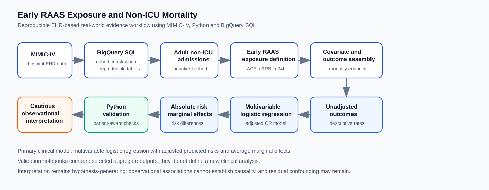
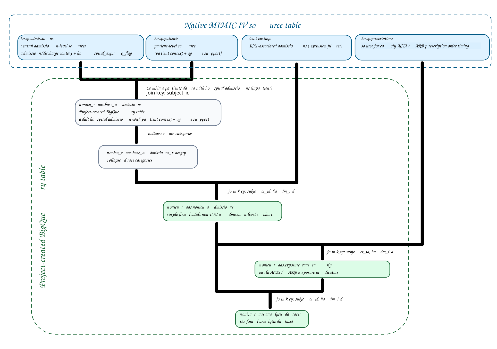
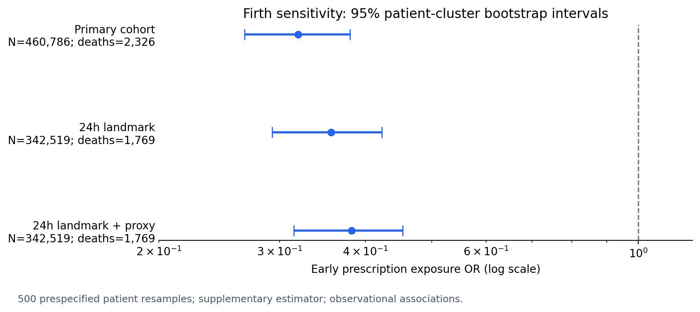
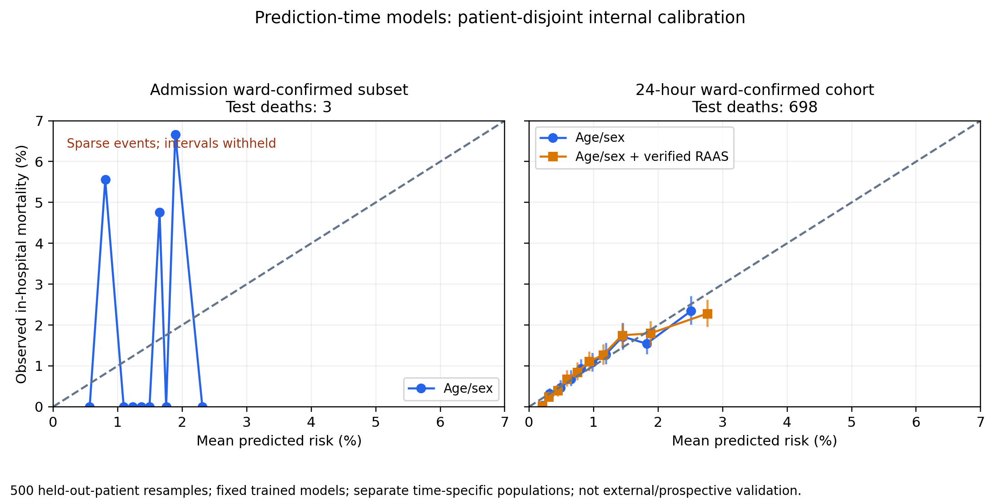
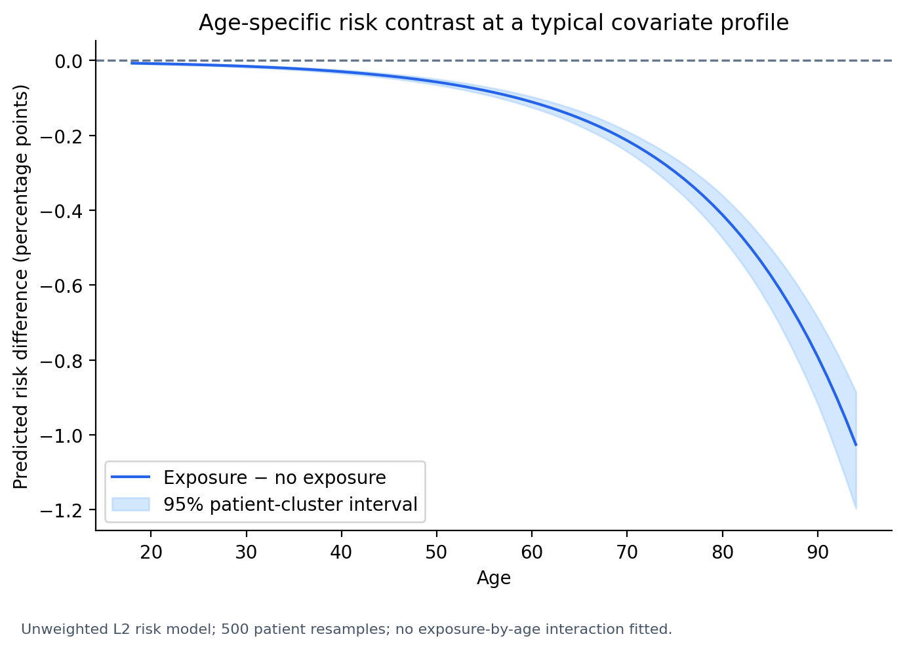

## Analytical Report Scope

This report presents the analytic outputs from an admission-level observational study of documented inpatient renin-angiotensin-aldosterone system (RAAS) prescription exposure within the first 24 hours and in-hospital mortality among adult non-ICU admissions in MIMIC-IV v3.1.

The emphasis is on reproducible clinical analytics: cohort construction, exposure definition, covariate handling, outcome modeling, absolute risk interpretation, and Python numerical checks and patient-aware evaluation.

The results remain hypothesis-generating. The design estimates associations after adjustment for measured covariates; it does not establish treatment effectiveness.

The original unpenalized primary/sensitivity fits have separation and remain nonconverged audit outputs. Supplementary Firth fits all converged; corrected landmark ordinary/proxy ORs were 0.356 (95% patient-cluster CI 0.292–0.423) and 0.382 (0.315–0.453). The separate unweighted L2 risk model returned AME -0.3797 percentage points (95% patient-cluster CI -0.4201 to -0.3407). Patient-disjoint discrimination and patient-cluster intervals are added validations; cohort/exposure definitions and full-data point estimates are preserved. All estimates remain observational.

## Reproducible Workflow

The portfolio has two separate branches. The original association workflow (01–04b) excludes ICU use over the entire admission and defines documented ACE inhibitor or ARB prescription exposure from 0–<24-hour start times. Supplementary Firth models estimate ORs; a separate unweighted L2 model estimates risks/AME, and another classifier evaluates retrospective discrimination. The additional prediction-time branch (04c) starts from adult base admissions and native transfer/ICU/order records. It confirms ward location, survival and continued hospitalization at admission or 24 hours, retains later ICU transfers and evaluates subsequent in-hospital death through discharge.

In the original association branch, the fixed non-ICU cohort is constructed before exposure definition or outcome modeling. The SQL eligibility rule does not use the prescription-exposure flag, and downstream outputs are traceable to one admission-level table. Excluding ICU use over the entire admission can still condition on post-admission events; this procedural ordering does not establish statistical independence or remove selection bias.

<figure class="figure">
  
  <figcaption>Separate original association and additional prediction-time workflows. <a href="../assets/workflow_diagram.svg" target="_blank" rel="noopener">Open full-size workflow diagram</a>.</figcaption>
</figure>

### Source Tables To Analysis Dataset

The lineage figure separates native MIMIC-IV source tables from SQL-derived, project-created BigQuery tables. It shows how source tables feed `nonicu_raas.nonicu_admissions`, the fixed adult non-ICU admission-level cohort; `nonicu_raas.exposure_raas_early`, which contains documented early inpatient ACEi / ARB prescription-exposure indicators; and `nonicu_raas.analysis_dataset`, the final analysis-ready dataset for the observational association analyses.

<figure class="figure">
  
  <figcaption>Source tables to analysis dataset lineage. <a href="../assets/nonicu_table_lineage_construction.svg" target="_blank" rel="noopener">Open full-size SVG</a>.</figcaption>
</figure>

## Cohort And Exposure

The analytic cohort contained 460,786 adult non-ICU hospital admissions. Documented inpatient RAAS prescription exposure within 24 hours was observed in 56,825 admissions, or 12.33% of the cohort. The cohort includes observation/day-case categories and is not a strict inpatient-only filter. The unit of analysis was the hospital admission (`hadm_id`); the cohort was not restricted to one admission per patient, so patients could contribute multiple admissions.

Source notebooks: [01_cohort.ipynb](https://github.com/makotoy56/mimic-iv-nonicu-medication/blob/main/notebooks/01_cohort.ipynb) and [02_exposure.ipynb](https://github.com/makotoy56/mimic-iv-nonicu-medication/blob/main/notebooks/02_exposure.ipynb).

| Cohort measure | Value |
| --- | ---: |
| Adult non-ICU hospital admissions | 460,786 |
| No documented early inpatient RAAS prescription exposure | 403,961 |
| Documented early inpatient RAAS prescription exposure | 56,825 |
| Documented prescription-exposure prevalence | 12.33% |
| In-hospital deaths | 2,326 |
| Overall in-hospital mortality | 0.50% |

## Baseline Characteristics

The full historical cohort includes 96 admission/discharge timestamp inversions (23 death flags). The primary cohort was retained as specified; those records are excluded by the corrected landmark rules. Full-cohort LOS summaries therefore include this timestamp-quality limitation.

The baseline table summarizes the existing Table 1-style outputs. The main imbalance relevant to interpretation is age: exposed admissions were substantially older than unexposed admissions, reinforcing the need for adjusted outcome modeling.

Source notebook and supporting documentation: [03b_describe_analysis_dataset.ipynb](https://github.com/makotoy56/mimic-iv-nonicu-medication/blob/main/notebooks/03b_describe_analysis_dataset.ipynb) and [03b_describe_analysis_dataset_SHORT.md](https://github.com/makotoy56/mimic-iv-nonicu-medication/blob/main/docs/03b_describe_analysis_dataset_SHORT.md).

| Characteristic | No documented early RAAS prescription | Documented early RAAS prescription exposure | Analytic implication |
| --- | ---: | ---: | --- |
| Admissions, n | 403,961 | 56,825 | Documented prescription exposure was present in 12.33% of admissions |
| Age, mean (SD), years | 56.65 (19.55) | 68.63 (14.01) | Exposed admissions were older |
| Age, median (IQR), years | 58.00 (41.00, 72.00) | 69.00 (59.00, 79.00) | Age imbalance supports adjustment |
| Hospital LOS, mean (SD), days | 3.75 (5.45) | 3.98 (5.13) | Length of stay was similar but slightly higher in exposed admissions |
| Hospital LOS, median (IQR), days | 2.33 (0.92, 4.58) | 2.75 (1.50, 4.79) | Descriptive only; not an exposure eligibility criterion |
| Female sex, n (%) | 218,834 (54.17%) | 27,549 (48.48%) | Sex distribution differed modestly by exposure group |
| Male sex, n (%) | 185,127 (45.83%) | 29,276 (51.52%) | Admissions with documented early prescription exposure were more frequently male |
| Any documented early RAAS prescription exposure | 0.00 | 1.00 | Primary exposure flag |
| Documented early ACE inhibitor prescription exposure | 0.00 | 0.682 | Exposure subtype among exposed admissions |
| Documented early ARB prescription exposure | 0.00 | 0.326 | Exposure subtype among exposed admissions |
| Both ACE inhibitor and ARB prescription-record flags in the early window | 0.00 | 0.008 | Records from both classes; no inference of simultaneous administration |

## Endpoint And Model Specification

| Component | Estimator / data | Interpretation and uncertainty |
| --- | --- | --- |
| Historical primary OR output | Unpenalized statsmodels Logit, full cohort | Separated/nonconverged; diagnostic archive only |
| Supplementary adjusted ORs | Firth/Jeffreys logistic regression, same covariates and cohort variants | Profile intervals assume admission independence; additional patient-cluster intervals resample entire patients |
| Discrimination | Class-balanced L2 sklearn logistic regression, training data only | Internal retrospective-discrimination ROC/PR AUC; no fixed prediction time; admission-row split retained as reference |
| Average risks / AME / age contrasts | Unweighted L2 sklearn logistic regression, full cohort | AME averages observed covariates; age curves use a typical mean profile; patient-cluster bootstrap intervals |

The main-effects model has no exposure-by-age interaction. Age-varying absolute contrasts should not be called a formal test of interaction or effect heterogeneity.

The primary endpoint was in-hospital mortality, defined by `hospital_expire_flag`. The primary model was a multivariable logistic regression adjusted for age, gender, race group, admission type, insurance category, and admission calendar period.

| Component | Specification |
| --- | --- |
| Unit of analysis | Hospital admission (`hadm_id`); patients may contribute multiple admissions |
| Primary exposure | Documented ACE inhibitor or ARB prescription record with `starttime` from admission through less than 24 hours |
| Primary endpoint | In-hospital mortality |
| Model family | Logistic regression |
| Adjustment set | Age, gender, race group, admission type, insurance category, anchor year group |
| Main estimands | Adjusted odds ratio, adjusted predicted risks, average marginal effect |
| Sensitivity models | 24-hour landmark model; 24-hour landmark plus admission-source proxy |

Both-class flags do not require overlapping prescriptions and do not establish co-administration. The prescription-based exposure definition does not confirm medication administration and does not directly measure outpatient chronic use, adherence, dose, treatment indication, or duration.

## Unadjusted Mortality

The unadjusted outcome table summarizes crude mortality estimates before covariate adjustment. These estimates are descriptive only and do not address baseline differences between exposure groups.

Source notebook and supporting documentation: [04a_unadjusted_outcomes.ipynb](https://github.com/makotoy56/mimic-iv-nonicu-medication/blob/main/notebooks/04a_unadjusted_outcomes.ipynb) and [04a_unadjusted_outcomes_SHORT.md](https://github.com/makotoy56/mimic-iv-nonicu-medication/blob/main/docs/04a_unadjusted_outcomes_SHORT.md).

| Exposure group | Admissions, n | Deaths, n | Non-deaths, n | Mortality proportion | Crude odds | Crude OR vs no early RAAS |
| --- | ---: | ---: | ---: | ---: | ---: | ---: |
| No documented early inpatient RAAS prescription exposure | 403,961 | 2,177 | 401,784 | 0.005389 | 0.005418 | 1.000 |
| Documented early inpatient RAAS prescription exposure | 56,825 | 149 | 56,676 | 0.002622 | 0.002629 | 0.485 |

{fig-alt="Bar chart comparing unadjusted in-hospital mortality by documented early inpatient RAAS prescription exposure" width="80%"}

## Unpenalized Model Diagnostics

The original unpenalized primary and four sensitivity models have separation and did not converge. Nominal intervals and p-values from these fits are not validated inference. Current finite OR summaries use the explicitly supplementary Firth fits, with patient-cluster intervals reported separately.

Notebook [04b_multivariable_outcomes.ipynb](https://github.com/makotoy56/mimic-iv-nonicu-medication/blob/main/notebooks/04b_multivariable_outcomes.ipynb) regenerates the [primary parameter diagnostics](https://github.com/makotoy56/mimic-iv-nonicu-medication/blob/main/python/outputs/mle_diagnostics.csv) and [five-model convergence comparison](https://github.com/makotoy56/mimic-iv-nonicu-medication/blob/main/python/outputs/landmark_model_comparison.csv). Historical nonconverged OR figures and the old coefficient display are excluded from the current report.

All original adjustment categories, including sparse admission types, are retained. The documented separation is a numerical/inferential limitation; the original model specification has not been changed to obtain convergence.

## Sensitivity Analyses

**Patient-aware update (2026-11-17):** Current uncertainty summaries use 500 prespecified patient-cluster bootstrap draws, carrying all eligible admissions per sampled patient. Firth point estimates and all exposure/cohort/adjustment definitions are unchanged. Historical admission-independent profile intervals remain available separately. See [patient-aware validation](https://github.com/makotoy56/mimic-iv-nonicu-medication/blob/main/docs/PATIENT_AWARE_VALIDATION.md).

The corrected sensitivity cohort requires confirmed survival and continued hospitalization beyond 24 hours, excluding exact-boundary and inconsistent records. The new figure and table below use the explicitly supplementary Firth estimator. They do not replace the original unpenalized primary fit or the separate risk-estimation model.

Source notebook: [04b_multivariable_outcomes.ipynb](https://github.com/makotoy56/mimic-iv-nonicu-medication/blob/main/notebooks/04b_multivariable_outcomes.ipynb).

{fig-alt="Firth exposure odds ratios with patient-cluster bootstrap intervals" width="80%"}

| Firth sensitivity model | Admissions | Patients | Deaths | OR | 95% patient-cluster CI | Accepted / requested |
| --- | ---: | ---: | ---: | ---: | --- | ---: |
| Primary cohort | 460,786 | 191,775 | 2,326 | 0.319 | 0.267–0.380 | 500/500 |
| Original condition | 460,350 | 191,591 | 1,890 | 0.362 | 0.303–0.426 | 500/500 |
| Original condition + proxy | 460,350 | 191,591 | 1,890 | 0.388 | 0.323–0.456 | 500/500 |
| 24h landmark | 342,519 | 153,041 | 1,769 | 0.356 | 0.292–0.423 | 500/500 |
| 24h landmark + proxy | 342,519 | 153,041 | 1,769 | 0.382 | 0.315–0.453 | 500/500 |

The following original profile intervals assume independent admissions and are retained as a secondary comparison. [Original profile figure](../assets/firth_landmark_sensitivity.png).

| Firth sensitivity model | Admissions | Deaths | OR | 95% profile CI | Converged |
| --- | ---: | ---: | ---: | --- | --- |
| Primary cohort | 460,786 | 2,326 | 0.319 | 0.269–0.376 | Yes |
| Original condition | 460,350 | 1,890 | 0.362 | 0.303–0.429 | Yes |
| Original condition + proxy | 460,350 | 1,890 | 0.388 | 0.325–0.460 | Yes |
| 24h landmark | 342,519 | 1,769 | 0.356 | 0.296–0.425 | Yes |
| 24h landmark + proxy | 342,519 | 1,769 | 0.382 | 0.317–0.455 | Yes |

All five Firth fits converged in 13–15 iterations. Exposure profile bounds were finite and independent adjusted-score checks were below 1e-5. A separation certificate was found for every corresponding unpenalized design, explaining why additional MLE iterations do not provide a finite full-model solution. Cohort definitions, exposure, adjustment categories and model admission counts were unchanged. Original MLE diagnostic outputs are retained in the validation files.

## Patient-Disjoint Retrospective Discrimination {#patient-disjoint-discrimination}

The patient-disjoint holdout is an internal evaluation of retrospective discrimination on the full admission cohort. It uses prescription records from 0–<24 hours while including deaths within 24 hours, and applies no 24-hour survival/continued-hospitalization eligibility filter. There is no fixed clinical prediction time or prospective prediction horizon: ROC AUC 0.860635 and PR AUC 0.117607 do not describe admission-time or 24-hour prognostic performance. Patient separation and train-only preprocessing address patient overlap and preprocessing leakage, not temporal feature availability. The 24-hour landmark association analyses separately require confirmed survival and continued hospitalization strictly beyond 24 hours and evaluate subsequent in-hospital death; they use a different eligible cohort.

| Validation | Train / test admissions | Test deaths | Overlapping patients | ROC AUC | PR AUC |
| --- | ---: | ---: | ---: | ---: | ---: |
| Admission-random reference | 368,628 / 92,158 | 465 | 42,796 | 0.857576 | 0.106915 |
| Patient-disjoint holdout | 368,309 / 92,477 | 468 | 0 | 0.860635 | 0.117607 |

A patient-disjoint 80/20 patient holdout (seed 42) has zero patient overlap. The same class-balanced L2 classifier specification is used; its scaler and categorical encoder are learned on training data only. The admission-random reference is a new deterministic-order calculation, distinct from the historical unordered-row AUC. A single split does not provide external validation, and the different case mixes preclude a claim that group splitting improved performance.

## Additional Prediction-Time Evaluation {#prediction-time-evaluation}

This is an **additional** prediction-time analysis in notebook 04c, separate from 04b's original association cohorts and retrospective discrimination (ROC AUC 0.860635 / PR AUC 0.117607). The outcome is death strictly after the prediction instant through recorded hospital discharge, with a variable hospital-stay horizon.

At admission and at 24 hours, eligibility requires survival, continued hospitalization, a single confirmed non-ICU target-ward transfer interval, and no ICU entry up to that instant. General/specialty, intermediate/stepdown and hospital observation wards are included; ED/ED observation, PACU, nursery and unknown/ambiguous location are excluded. Later ICU transfers remain followed. No later ward entry backfills an unknown admission location. Admission-time results therefore apply to the ward-confirmed subset, not all admissions. This replaces neither the entire-stay ICU exclusion nor the numbers in the original association analyses.

The primary predictors are reconstructed age and recorded sex. A 24-hour companion adds a qualifying 0–<24h RAAS prescription record whose linked POE order time is no later than 24 hours; unverified or later order times cannot make the feature positive. This differs from the original association exposure. Records do not establish medication administration. Untimestamped demographics are assumed available at admission; original entry/version history is unavailable.

| Time | Eligible admissions / deaths | Train admissions | Test admissions / deaths | Later ICU admissions retained |
| --- | --- | --- | --- | --- |
| Admission | 719 / 11 | 556 | 163 / 3 | 258 |
| 24 hours | 336,372 / 3,457 | 268,731 | 67,641 / 698 | 15,329 |

| Model | ROC AUC (95% CI) | PR AUC / AP (95% CI) | Brier |
| --- | --- | --- | --- |
| Admission: age/sex | 0.548958 (CI withheld) | 0.030599 (CI withheld) | 0.018112 |
| 24h: age/sex | 0.686252 (0.668263–0.700923) | 0.021281 (0.018373–0.026761) | 0.010167 |
| 24h: age/sex + verified RAAS record | 0.699762 (0.681841–0.714670) | 0.022521 (0.019358–0.028395) | 0.010162 |

The protocol used unweighted L2 logistic regression (C=1, lbfgs, max_iter=2000), with training-only imputation, scaling and categorical encoding. One 80/20 patient allocation (seed 42) was fixed on the adult base before time-specific eligibility filters; all admissions of each patient stay in one partition. No test-driven tuning or recalibration was performed. Each model fit converged, with zero patient overlap. Each 24-hour model had 500/500 successful held-out-patient resamples. Admission had only 3 test deaths: 33/500 resamples had one outcome class, leaving 467/500 below the prespecified 95% threshold; all admission bootstrap intervals are withheld. Its point metrics/calibration are sparse-event diagnostics and do not establish reliable admission-time performance. Available 95% percentile intervals condition on the fitted training model and exclude training-sample uncertainty. Calibration is diagnosed without changing predictions. PR AUC is average precision (AP).

The admission and 24-hour populations differ. Metric differences across times are not evidence of improvement. The companion is a feature comparison, not a treatment-effect estimate. These limited-feature retrospective internal models are not prospective, external or deployment validation.

| Model | Observed / mean predicted mortality | Calibration intercept / slope | Brier / constant-risk reference |
| --- | --- | --- | --- |
| Admission: age/sex | 1.840% / 1.406% | -4.2455 / -0.0621 | 0.018112 / 0.018082 |
| 24h: age/sex | 1.032% / 1.036% | 0.0879 / 1.0213 | 0.010167 / 0.010213 |
| 24h: age/sex + verified RAAS record | 1.032% / 1.039% | -0.0030 / 1.0008 | 0.010162 / 0.010213 |

Calibration intercept/slope are diagnostic holdout fits (ideal 0/1), not applied recalibrations. Brier is probability mean squared error; the reference predicts the training event rate.

{fig-alt="Calibration of admission and 24-hour ward-confirmed prediction models" width="100%"}

The protocol was amended during cohort review to require confirmed ward location; initial no-prior-ICU working outputs are retained privately, and feature/estimator tuning was not based on holdout performance. [Protocol](https://github.com/makotoy56/mimic-iv-nonicu-medication/blob/main/docs/PREDICTION_TIME_PROTOCOL.md) and [real-data validation](https://github.com/makotoy56/mimic-iv-nonicu-medication/blob/main/docs/PREDICTION_TIME_VALIDATION.md) document all exclusion reasons, interval reconstruction, POE coverage and a separately labelled ICU-chronology sensitivity. The original association cohort/results remain unchanged.

## Absolute Risk Interpretation

The adjusted odds ratio is a relative measure. Because in-hospital mortality was uncommon in this non-ICU cohort, the project also reported adjusted predicted risks and average marginal effects. The fitted model produced an average adjusted predicted mortality difference of approximately -0.38 percentage points between the documented-exposure and no-exposure scenarios.

Source notebook: [04b_multivariable_outcomes.ipynb](https://github.com/makotoy56/mimic-iv-nonicu-medication/blob/main/notebooks/04b_multivariable_outcomes.ipynb).

{fig-alt="Adjusted predicted mortality curves by age and documented early inpatient RAAS prescription exposure" width="90%"}

Because this is an observational model-based estimate, the curves should be interpreted as adjusted predicted probabilities under the fitted model, not as causal treatment effects. The age curves hold other covariates at a typical mean profile. No exposure-by-age interaction was fitted; variation in absolute contrasts is a model implication, not a formal interaction test.

| Unweighted L2 risk estimand | Estimate | 95% patient-cluster CI |
| --- | ---: | --- |
| Mean predicted risk: no exposure | 0.5733 % | 0.5487 to 0.5991 % |
| Mean predicted risk: exposure | 0.1936 % | 0.1596 to 0.2239 % |
| Average marginal effect (difference) | -0.3797 percentage points | -0.4201 to -0.3407 percentage points |

{fig-alt="Age-specific typical-profile risk difference with patient-cluster intervals" width="90%"}

The current risk/AME table and age-contrast figure use 500 prespecified patient-cluster draws. The full risk fitting procedure is repeated with frequency-weighted scaling and fitting. Firth bootstrap refits that trigger Newton warnings must pass the same-objective numerical recovery and independent score checks; accepted/recovered/failed counts are documented. Failed draws are counted, never silently replaced; intervals require at least 95% successful draws. The 500-draw percentile endpoints retain Monte Carlo error. [Full patient-aware validation](https://github.com/makotoy56/mimic-iv-nonicu-medication/blob/main/docs/PATIENT_AWARE_VALIDATION.md).

## Python Reproducibility Checks

The public workflow covers BigQuery construction and Python analysis through notebook 04c, with separate association and prediction-time evaluations. Numerical tests, fit diagnostics, patient-cluster resampling and patient-disjoint evaluation are documented in the [reproducible scope](https://github.com/makotoy56/mimic-iv-nonicu-medication/blob/main/docs/REPRODUCIBLE_SCOPE.md). These checks do not establish causal validity.

## Interpretation Boundary

The finite supplementary Firth estimates and the separate L2 risk contrasts were directionally consistent. The original unpenalized MLE remains nonconverged; numerical agreement alone would not establish valid inference. The analysis remains observational.

The main sources of potential bias are residual confounding by indication, unmeasured comorbidity burden, acute physiologic severity, outpatient medication history, prescribing behavior, medication discontinuation, dose, duration, adherence, and selection effects related to early survival and treatment eligibility.

Exposure was based on inpatient prescription records. It did not directly measure outpatient chronic RAAS inhibitor use, medication adherence before admission, confirmed inpatient administration, dose, treatment indication, or duration of therapy. The outcome was limited to in-hospital mortality.

The unit of analysis is the hospital admission (`hadm_id`). Historical profile intervals assumed independent admissions. Added patient-cluster bootstrap intervals and patient-disjoint evaluation address repeated admissions separately. These changes do not remove residual confounding or the selection induced by excluding any ICU stay over the entire admission.

## Reproducibility And Governance

Reproducibility was addressed by separating cohort construction, exposure definition, model estimation, figure generation, and Python numerical checks into version-controlled workflow steps. The rendered report is supported by notebooks, SQL definitions, aggregate validation outputs, and exported figures, while patient-level MIMIC-IV data remain outside the repository.

For complete environment and reproducibility details, see [REPRODUCIBILITY.md](https://github.com/makotoy56/mimic-iv-nonicu-medication/blob/main/REPRODUCIBILITY.md).

MIMIC-IV and PhysioNet access, Google Cloud authentication, BigQuery access, and local environment settings are configured outside the repository.

The original 00–04b workflow at `615de01` was reexecuted with fresh repository kernels, followed by separate notebook 04c: 8 notebooks / 93 code cells, zero runtime error outputs. Connected BigQuery checks and original aggregate comparisons passed. [Current execution and source-preservation evidence](https://github.com/makotoy56/mimic-iv-nonicu-medication/blob/main/docs/CLINICAL_REEXECUTION_615de01.md) distinguishes runtime success, separated MLE diagnostics and new prediction calibration. [Historical baseline evidence](https://github.com/makotoy56/mimic-iv-nonicu-medication/blob/main/docs/PYTHON_WORKFLOW_VALIDATION.md) remains available. Local outputs are saved; Git strips notebook outputs/counts.

## Conclusion

Documented early inpatient RAAS prescription exposure was associated with lower in-hospital mortality in this adult non-ICU MIMIC-IV cohort after adjustment for measured covariates. The association was also presented on the absolute risk scale, where the difference in adjusted predicted mortality risk was small in percentage-point terms and varied by age.

The portfolio value of the project is the reproducible EHR clinical analytics workflow: transparent cohort and prescription-exposure definitions, multivariable modeling, absolute risk interpretation, cautious observational framing, a visible 24-hour landmark sensitivity analysis, and documented Python numerical checks using current aggregate outputs.
